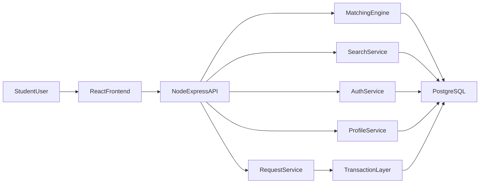

UCLA Roommate Matching Web App - Product Requirements Document (PRD)
- Project Name: Bruin Match
- Product Type: Full-stack web application (React + Node.js + PostgreSQL)

1) Project Overview
Bruin Match is a UCLA-focused roommate matching platform that helps students discover compatible roommates using structured profiles, lifestyle surveys, and server-side matching. The product addresses the pain point that students currently rely on scattered social media posts, inconsistent spreadsheets, or friend-of-friend networks to find housing-compatible roommates.

The app provides an end-to-end flow:
1. User signs up/logs in.
2. User completes profile + 10-question lifestyle survey.
3. Dashboard displays ranked matches (dynamic server-driven data).
4. User searches and filters candidates.
5. User sends roommate requests.
6. Recipients accept/deny requests.
7. Accepted users form a roommate group.

2) Problem Statement
UCLA students need a reliable and structured way to find compatible roommates, but existing methods are:
- weak in preference matching,
- poor at tracking request statuses
Bruin Match solves this by combining profile standardization, compatibility scoring, secure authentication, and explicit request/group workflows.

3) Goals, Success Metrics, and Non-Goals
Goals
- Deliver a secure matching platform with meaningful compatibility ranking.
- Satisfy all rubric requirements with strong evidence artifacts.
- Keep UX simple, clean, and easy to navigate.
- Ensure data integrity with ACID-compliant server-side storage.

Success Metrics (MVP)
- >= 90% of test users complete onboarding (profile + survey) in under 5 minutes.
- Match dashboard loads top results in <= 1.5s for test dataset of 1,000 users.
- 100% of protected routes reject unauthenticated users.
- 0 known critical security defects before submission.

Non-Goals (for initial submission)
- UCLA SSO/OAuth integration with real university identity provider.
- Native mobile app.
- Real-time chat feature (can be stretch goal).

4) Target Users and Personas

     Persona A: First-Year Student (Primary)
- Needs: quick roommate discovery, clear compatibility indicators.
- Behaviors: compares many profiles quickly, uses filters heavily.
- Pain Points: uncertainty about roommate habits and schedules.

    Persona B: Transfer/Upperclass Student
- Needs: precise preferences (sleep, cleanliness, guest policy, housing type).
- Behaviors: fewer but stricter candidate reviews.
- Pain Points: low-quality matches, wasted outreach.

    Persona C: Group Organizer
- Needs: manage incoming/outgoing requests and finalize groups.
- Behaviors: sends multiple requests and tracks statuses.
- Pain Points: no clear workflow for accepting/declining and group confirmation.

   5) User Journey
1. Landing page -> login/signup.
2. Authenticated dashboard checks onboarding completeness.
3. If profile incomplete -> onboarding flow (profile + survey).
4. Browse dashboard shows ranked candidate cards.
5. User applies filters/search query.
6. User opens candidate detail card and sends request.
7. Recipient accepts/denies.
8. On acceptance, group membership is created/updated.
9. Group page shows confirmed members and request history.

   6) Functional Requirements (with Acceptance Criteria)

    FR-1 Authentication and Authorization
- Users can sign up with email + password and log in securely.
- Protected routes require a valid auth token/session.
- Unauthorized access redirects to login.

Acceptance Criteria:
- Attempting to access dashboard without token returns 401 from API and redirects on client.
- Passwords are hashed (bcrypt/argon2), never stored in plain text.
- Login returns token/session and user identity payload.

    FR-2 Profile Creation and Editing
- Users create a profile with required fields:
  - full name, age, UCLA year, major
  - housing type preference, room type, move-in term
  - optional contact/social details
- Users can edit profile after initial creation.

Acceptance Criteria:
- Backend validates required fields and data formats.
- Profile changes persist and display immediately on next dashboard load.
- Invalid/missing required fields return user-readable validation errors.

    FR-3 Lifestyle Survey (10 Questions)
- User completes 10 preference questions (sleep schedule, guests, noise, cleanliness, etc.).
- Answers are normalized into a preference vector for matching.

Acceptance Criteria:
- Survey cannot submit with unanswered required questions.
- Survey updates can be resubmitted and overwrite previous answers atomically.
- Stored survey answers feed compatibility computation.

    FR-4 Dynamic Match Dashboard
- Dashboard fetches and displays match cards from server-side ranked results.
- Match list updates when filters/search are changed.

Acceptance Criteria:
- Candidate cards include core profile data + compatibility score.
- Changing filters updates visible candidates without full page reload.
- Results are sorted by compatibility descending by default.

    FR-5 Meaningful Search and Filtering (Server-Side)
- Users can search and filter candidates by:
  - major
  - academic year
  - housing/room type
  - lifestyle dimensions (sleep, guests, noise, etc.)
  - optional budget/move-in term if enabled
- Search must execute on server and return ranked/filter-matching records.

Acceptance Criteria:
- Search query returns relevant records from database (not client-only filtering of static list).
- Combined filters narrow results correctly.
- Empty/no-match results return graceful state.

    FR-6 Roommate Request Workflow
- Users can send roommate requests to candidates.
- Recipients can accept or deny requests.
- Request states: pending, accepted, denied, withdrawn, expired (optional).

Acceptance Criteria:
- Duplicate active requests between same users are prevented.
- Request status updates are persisted and visible to both sides.
- Users cannot accept requests not addressed to them.

    FR-7 Roommate Group Formation
- Accepted requests create or update roommate groups.
- Group page shows current members and invitation statuses.

Acceptance Criteria:
- Group membership writes are transactional.
- A user cannot belong to conflicting active groups (enforce business rule).
- Group state is reflected dynamically in dashboard/group page.

    FR-8 Additional Distinct Feature 1: Compatibility Explanation
- Each match card shows a concise "why this match" summary.
- Example: "Similar sleep schedule + quiet preference + same move-in term."

Acceptance Criteria:
- Explanation is generated from survey similarity dimensions.
- At least three meaningful factors are shown when available.

    FR-9 Additional Distinct Feature 2: Saved Filter Presets
- Users can save named filter sets (e.g., "Same Major + Night Owl").
- Saved presets can be applied in one click.

Acceptance Criteria:
- Presets persist per user in database.
- Applying preset refreshes results immediately.

    FR-10 Additional Distinct Feature 3: Notifications Center
- Users receive notifications for request events (received/accepted/denied).
- Notifications can be marked as read.

Acceptance Criteria:
- Notification records are created on request state transitions.
- Unread count updates on dashboard dynamically.

    FR-11 Additional Distinct Feature 4 (Optional Stretch): Safety Controls
- Users can block/report suspicious accounts.
- Blocked users are excluded from search/match results.

Acceptance Criteria:
- Block action prevents future request actions between two accounts.
- Report action stores report metadata for admin review simulation.

   7) Technical Architecture

    Frontend
- React + React Router for page routing and protected route guards.
- State management via React state/context.
- UI pages: Home, Login, Signup, Onboarding, Dashboard, Browse, Group/Requests.

    Backend
- Node.js + Express REST API.
- Middleware for auth, validation, rate limiting, and error handling.
- Service layer for matching, search, and request orchestration.

    Database
- PostgreSQL (recommended for strong ACID compliance).
- Migrations/schema tracked in repo.

   8) Data Model Requirements

Core tables:
- `users`: auth identity, hashed password, created timestamps.
- `user_profiles`: demographic + housing profile fields.
- `user_preferences`: survey/lifestyle answers.
- `roommate_requests`: sender, receiver, status, timestamps.
- `roommate_groups`: group metadata, lifecycle status.
- `group_memberships`: group_id + user_id + role.
- `match_scores` (optional denormalized cache): compatibility score breakdown.
- `saved_filters`: user-defined search presets.
- `notifications`: event-driven alerts.
- `user_blocks` / `user_reports` (if safety feature implemented).

Constraints:
- Unique constraints to prevent duplicate active requests.
- Foreign keys with cascade rules where appropriate.
- Check constraints for valid status enums.

   9) ACID and Transactional Integrity Requirements

    ACID Guarantees (Required)
- Atomicity: multi-step operations (e.g., accept request + update group + create notifications) must be wrapped in a single transaction.
- Consistency: DB constraints ensure legal state transitions and relational integrity.
- Isolation: use transaction isolation to prevent race conditions in simultaneous request actions.
- Durability: committed operations persist after server restart.

    Critical Transactional Flows
1. Accept roommate request:
   - validate pending request
   - set request to accepted
   - create/update group
   - add memberships
   - create notifications
2. Profile + survey update:
   - update profile and preferences together, or roll back both.

   10) API Requirements (Initial Endpoint Set)

Authentication:
- `POST /api/auth/signup`
- `POST /api/auth/login`
- `POST /api/auth/logout` (if session-based)
- `GET /api/auth/me`

Profiles and Survey:
- `GET /api/profile/me`
- `PUT /api/profile/me`
- `GET /api/preferences/me`
- `PUT /api/preferences/me`

Search and Matching:
- `GET /api/matches?query=&major=&year=&...`
- `GET /api/users/:id`
- `GET /api/filters/saved`
- `POST /api/filters/saved`
- `DELETE /api/filters/saved/:id`

Requests and Groups:
- `POST /api/requests`
- `GET /api/requests/incoming`
- `GET /api/requests/outgoing`
- `PATCH /api/requests/:id` (accept/deny/withdraw)
- `GET /api/groups/me`

Notifications:
- `GET /api/notifications`
- `PATCH /api/notifications/:id/read`

   11) Security Requirements

    SEC-1 Authentication Security
- Hash passwords with bcrypt/argon2.
- Enforce minimum password strength.
- Token/session expiration and secure storage policy.

    SEC-2 Authorization
- Verify user ownership for profile edits, request actions, and group views.
- Prevent IDOR vulnerabilities by server-side user checks.

    SEC-3 Input Validation and Injection Defense
- Validate and sanitize all user input.
- Parameterized SQL queries only (no string concatenation).

    SEC-4 Session/Token Protections
- If JWT: short expiry + refresh strategy (optional) and secure client handling.
- If cookie session: `httpOnly`, `secure`, `sameSite` settings.

    SEC-5 Abuse and Privacy Controls
- Basic rate limiting on auth/search endpoints.
- Do not expose sensitive fields in API responses.
- Audit logs for critical actions (login, request decisions).

   12) Non-Functional Requirements

    NFR-1 Performance
- 95th percentile API response under 500ms for common read endpoints in local test conditions.
- Search returns first page within 1.5s for 1,000-record dataset.

    NFR-2 Reliability
- Standardized error responses.
- Graceful fallback states for empty/missing data.

    NFR-3 Usability and Visual Design
- Clear page hierarchy and obvious next actions.
- Consistent spacing, typography, button semantics, and feedback states.
- Mobile-responsive layout (minimum tablet + desktop, ideally mobile too).

    NFR-4 Maintainability
- Route/service separation in backend.
- Reusable components in frontend.
- Clear naming conventions and concise in-code documentation where needed.

   13) Rubric Mapping Matrix

    4% - Dynamic Data Display
- Evidence: Dashboard fetches live match list, request statuses, notification counts from API.
- Deliverables: dynamic UI states, loading states, empty states.

    4% - Upload Data Client -> Backend -> Database
- Evidence: Profile/survey/request submissions persist to PostgreSQL.
- Deliverables: form validation, successful writes, reload persistence proof.

    4% - Meaningful Server-Side Search
- Evidence: query/filter endpoint over profile + preference fields with ranked results.
- Deliverables: multi-field filters and relevant response ordering.

    21% - Three Additional Distinct Features
- Feature A: Compatibility explanation module.
- Feature B: Saved filter presets.
- Feature C: Notifications center.

    8% - Meaningful Git Understanding
- Evidence: clean commit history, feature branches, PR reviews, issue linkage.
- Deliverables: each member contributes own commits; no one-person mega-commit.

    5% - Detailed README
- Evidence: complete setup/run docs from clone to local usage.
- Deliverables: prerequisites, env vars, DB setup, migrations, seed, run commands.

    5% - Visual Quality and Navigation
- Evidence: intuitive page flow, polished styles, consistent UX patterns.
- Deliverables: design pass with spacing/color/type consistency and responsive checks.

   14) Skills Required by Team

    Product/Planning
- Requirements writing, acceptance criteria definition, scope control.

    Frontend (React)
- Routing, form handling, API integration, state management, component design.
- Accessibility basics and responsive UI implementation.

    Backend (Node.js/Express)
- REST API design, middleware, validation, business logic implementation.
- Error handling and transaction orchestration.

    Database (PostgreSQL)
- Schema design, indexing, constraints, migrations, transaction handling.
- Query optimization for filtered search.

    Security
- Auth best practices, password hashing, route protection, OWASP fundamentals.

    QA/Testing
- Unit/integration tests for APIs and core workflows.
- Manual test scripts for UI acceptance checks.

    DevOps/Tooling
- Environment configuration, scripts, local setup automation.
- CI checks (optional but recommended).

   15) Git and Collaboration Requirements
- Use a private GitHub repo.
- Branch strategy: `main` + short-lived feature branches.
- PR required for merging major features.
- Commit conventions:
  - frequent, meaningful commits
  - each member authors their own commits
  - commit messages explain intent and scope.
- Suggested tags/issues for milestone tracking.

   16) README Requirements (Grading-Critical)
Root `README.md` must include:
- project purpose and feature summary,
- tech stack and architecture overview,
- prerequisites (Node version, PostgreSQL version),
- environment variable template (`.env.example`),
- database setup steps (create DB, run schema/migrations, optional seed),
- exact shell commands to run backend and frontend,
- test commands,
- known limitations and assumptions,
- team contribution overview.

Example command block (must be accurate for your repo scripts):
- `npm install`
- `cd backend && npm install && npm run dev`
- `cd frontend && npm install && npm run dev`

   18) Testing and Validation Plan

    Backend Tests
- Auth success/failure flows.
- Profile and survey CRUD validation.
- Search endpoint filtering accuracy.
- Transactional request acceptance flow (including rollback behavior).

    Frontend Tests / Manual QA
- Protected route behavior.
- Onboarding form validation and persistence.
- Dashboard ranking/filter interactions.
- Request decision workflows and notification updates.

    Security Checks
- SQL injection attempts blocked.
- Unauthorized route access denied.
- Password hashing verified in DB.

    Submission Readiness Checklist
- All rubric categories demonstrably implemented.
- README fully reproducible by a fresh clone.
- App is visually coherent and easy to navigate.
- Git history shows distributed team contribution.

   19) Risks and Mitigations
- Risk: Matching logic too simplistic.
  - Mitigation: weighted scoring with documented criteria and explanation output.
- Risk: Race conditions in request/group creation.
  - Mitigation: DB transactions and unique constraints.
- Risk: Incomplete README hurts grading.
  - Mitigation: one team member owns README QA with fresh-machine simulation.
- Risk: Last-minute UI inconsistency.
  - Mitigation: style tokens/checklist and dedicated visual polish sprint.

   20) Definition of Done
Project is complete when:
1. All required rubric functions work end-to-end in demo.
2. At least three additional distinct features are complete and tested.
3. Security and ACID requirements are implemented in critical workflows.
4. README allows a grader to run app locally without missing steps.
5. UI is polished, navigable, and consistent across major flows.
